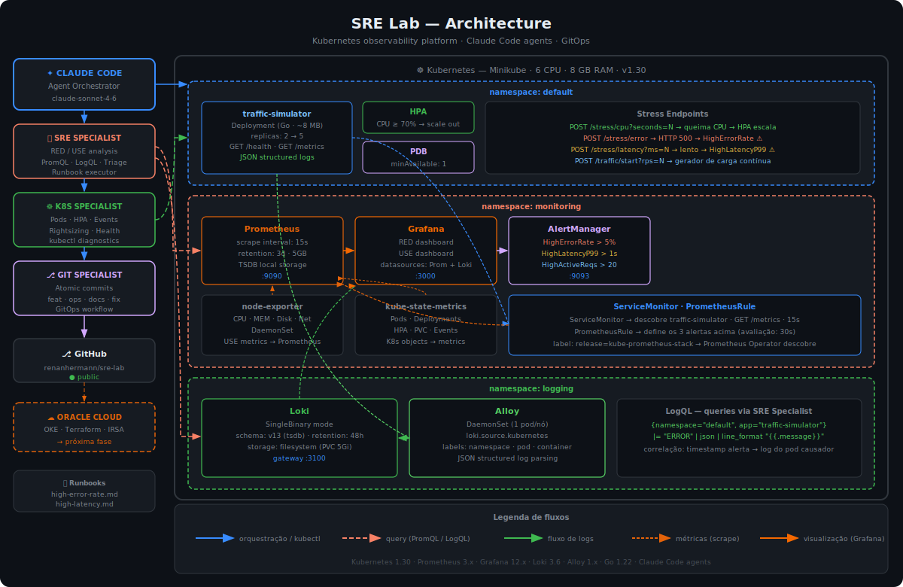

# SRE Lab

Laboratório pessoal de SRE com Kubernetes, observabilidade completa, SLO
formal com burn rate alerts, infraestrutura como código no Oracle Cloud
e agents Claude Code. Construído para demonstrar operação sênior: SLI/SLO,
runbooks executáveis, GitOps, chaos engineering e cloud provisioning.

## Arquitetura



## Stack

| Camada | Tecnologia |
|---|---|
| K8s local | Minikube (profile: `sre-lab`, driver: docker) |
| K8s cloud | Oracle Kubernetes Engine (OKE) provisionado via Terraform |
| Métricas | kube-prometheus-stack (Prometheus + Grafana + AlertManager) |
| Logs | Grafana Loki + Alloy (coleta via Kubernetes API) |
| Confiabilidade | SLO formal com error budget e burn rate multi-window/multi-burn-rate |
| App de teste | `traffic-simulator` — Go, ~8MB, endpoints RED + chaos primitives |
| Automação | Claude Code (agents: SRE Specialist, K8s Specialist, Git Specialist) |

## Como subir

```bash
# Sobe o cluster Minikube
./cluster/start.sh

# Expõe os serviços localmente (manter aberto)
./cluster/expose.sh
```

Após o `expose.sh`:

| Serviço | URL | Credenciais |
|---|---|---|
| Grafana | http://localhost:3000 | admin / srelab123 |
| Prometheus | http://localhost:9090 | — |
| AlertManager | http://localhost:9093 | — |
| App de teste | http://localhost:8080 | — |

## SLO formal

Dois SLOs definidos em `manifests/slo/`, com recording rules pré-calculadas
e quatro classes de burn rate alerts (Google SRE Workbook, cap 5):

| SLO | Target | Error budget mensal |
|---|---|---|
| Disponibilidade | 99.5% das requests | ≈ 3h36min |
| Latência | 99% das requests ≤ 500ms | ≈ 7h12min de tráfego lento |

Dashboard: **SLO — traffic-simulator** no Grafana.
Documento formal e playbook de validação: [`docs/slo.md`](docs/slo.md).

## Chaos test automatizado

Validação end-to-end do pipeline de SLO (recording rules → burn rate
alerts → recuperação) com pass/fail determinístico:

```bash
make chaos-baseline    # ~5s   — só valida que sistema está saudável
make chaos-quick       # ~5min — fault → confirma firing (sem recovery)
make chaos-test        # ~10-15min — ciclo completo, retorna pass/fail
```

Documento de uso, parâmetros, códigos de saída e plano de integração CI:
[`docs/chaos-testing.md`](docs/chaos-testing.md).

## Gerando carga e disparando alertas

```bash
# Inicia gerador interno (5 req/s, em loop)
curl -X POST "http://localhost:8080/traffic/start?rps=5"
curl -X POST  http://localhost:8080/traffic/stop

# Chaos primitives — disparam alertas RED do app
curl -X POST  http://localhost:8080/stress/error              # → HighErrorRate
curl -X POST "http://localhost:8080/stress/latency?ms=2000"   # → HighLatencyP99
curl -X POST "http://localhost:8080/stress/cpu?seconds=30"    # → HPA escala

# Fault injection no caminho de produção — dispara burn rate alerts do SLO
# (rate=N% de 5xx em /health por duration, auto-reset, cap 30min)
curl -X POST "http://localhost:8080/admin/fault?rate=40&duration=10m"
curl -X POST "http://localhost:8080/admin/fault?rate=0"       # desativa
```

Observação importante: `/stress/*` são endpoints de chaos *explícitos* e
**não** consomem error budget (excluídos do SLI via `path !~ "/stress/.*"`).
Já `/admin/fault` injeta falha em `/health` — caminho de produção — e
portanto **consome budget de verdade**. Ver `docs/slo.md` §6 pro playbook
completo de validação.

## Agents Claude Code

| Agent | Responsabilidade |
|---|---|
| `sre-specialist` | Analisa RED (Rate/Errors/Duration) + USE, consulta Prometheus e Loki, gera relatório com causa raiz |
| `k8s-specialist` | Monitora pods, HPA, eventos, uso de recursos e recomenda rightsizing |
| `git-specialist` | Commits atômicos, branches por feature, histórico GitOps limpo |

## Runbooks

- [HighErrorRate](docs/runbooks/high-error-rate.md) — erro rate > 5% por 1 minuto
- [HighLatencyP99](docs/runbooks/high-latency.md) — P99 > 1s por 2 minutos
- [SLO Burn Rate](docs/runbooks/slo-burn-rate.md) — resposta a alertas de SLO

## Oracle Cloud (OKE)

Infraestrutura como código em `terraform/`, dividida por responsabilidade
(padrão do `eks-stack` pessoal):

- `terraform/00-foundation/` — VCN, gateways, route tables, security lists, subnets
- `terraform/01-oke/` — cluster OKE + node pool (Standard3.Flex, 2 OCPUs/8GB)

```bash
# Sobe
cd terraform/00-foundation && terraform apply -auto-approve
cd ../01-oke && terraform apply -auto-approve
oci ce cluster create-kubeconfig --cluster-id $(terraform output -raw cluster_id) \
  --file ~/.kube/config-oci --region sa-saopaulo-1 --token-version 2.0.0

# Destrói (economiza crédito do free trial)
./terraform/destroy-cluster.sh
```

## Estrutura

```
sre-lab/
├── app/                  # traffic-simulator em Go
│   ├── main.go           # servidor HTTP + métricas RED + chaos primitives
│   ├── Dockerfile        # multi-stage build (scratch ~8MB)
│   └── go.mod
├── cluster/              # start.sh + expose.sh do Minikube
├── helm/                 # values: kube-prometheus-stack, loki, alloy
├── manifests/
│   ├── app/              # Deployment, Service, HPA, PDB, ServiceMonitor, PrometheusRule
│   └── slo/              # SLO availability + latency + dashboard Grafana
├── scripts/
│   ├── chaos-test.sh     # validação automatizada do pipeline de SLO
│   └── lib/              # log, prom, app helpers
├── Makefile              # make help — atalhos de cluster/app/SLO/chaos
├── terraform/
│   ├── 00-foundation/    # VCN e network
│   ├── 01-oke/           # cluster OKE
│   └── destroy-cluster.sh
├── docs/
│   ├── architecture.svg  # diagrama da arquitetura
│   ├── slo.md            # SLO formal: definições, burn rate, error budget policy
│   ├── chaos-testing.md  # validação automatizada do pipeline de SLO
│   └── runbooks/         # runbooks executáveis por agent
└── .claude/agents/       # definições dos agents Claude Code
```

## Roadmap

- [x] **Fase 1** — Cluster local + observabilidade (Prometheus, Loki, Grafana, Alloy)
- [x] **Fase 1** — App de teste em Go com métricas RED e endpoints de stress
- [x] **Fase 1** — Alertas, HPA, PDB e runbooks operacionais
- [x] **Fase 1** — Agents Claude Code (SRE, K8s, Git Specialist)
- [x] **Fase 2** — Provisionamento OKE no Oracle Cloud via Terraform
- [x] **Fase 3** — SLO formal com error budget e burn rate alerts (4 janelas)
- [x] **Fase 3** — Chaos primitive `/admin/fault` para validar SLO
- [x] **Fase 3** — Dashboard Grafana de SLO (ConfigMap auto-importado)
- [x] **Fase 4** — Chaos test automatizado (`make chaos-test`, validação end-to-end)
- [ ] **Fase 4** — Workflow GitHub Actions executando chaos test em PR
- [ ] **Fase 4** — Postmortem automatizado via git-specialist agent
- [ ] **Fase 4** — Replicar stack Minikube no OKE (Helm + manifests + SLO)
- [ ] **Fase 4** — FinOps dashboard (custo por namespace)
